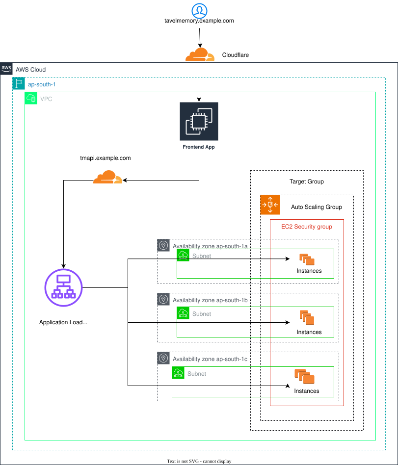

# ✈️ TravelMemory – Fullstack Deployment on AWS

This project deploys a MERN stack travel memory application using AWS services like EC2, ALB, ASG, Target Groups, and Cloudflare for security and DNS.

---

## 📁 Folder Structure

```
TravelMemory/
│
├── backend/              # Node.js Express backend
├── frontend/             # Vite + React frontend
├── setup-backend.sh      # Backend provisioning script (Auto Scaling)
└── setup-frontend.sh     # Frontend EC2 static deployment script
```

---

## ⚙️ Prerequisites

Before deploying this application, ensure the following:

- ✅ A valid AWS account with permissions to create EC2, ALB, ASG, and Target Groups
- ✅ Domain access via Cloudflare (e.g., `example.com` and subdomain `api.example.com`)
- ✅ MongoDB Atlas cluster (URI needed in backend `.env`)
- ✅ Security group rules allowing HTTP (80), HTTPS (443), and backend port (3000)
- ✅ Ubuntu-based EC2 AMI with internet access for installing dependencies

---

## 🛠 Installation Instructions

### 📦 Required Services

Ensure the following packages are installed on your EC2 instances:

- **Nginx** – Reverse proxy for both backend and frontend
- **Node.js v22** – JavaScript runtime environment for backend and Vite frontend build
- **PM2** – Process manager for running the backend as a service

### 🧪 PM2 Common Commands

```bash
# Start your backend application using PM2
pm2 start index.js --name "travel-memory-backend"

# View all running PM2 processes
pm2 list

# View logs for a specific process
pm2 logs travel-memory-backend

# Restart a process by name
pm2 restart travel-memory-backend

# Stop a process
pm2 stop travel-memory-backend

# Delete a process from PM2
pm2 delete travel-memory-backend

# Save process list to start on reboot
pm2 save

# Re-generate startup script after reboot
pm2 startup
```

### 🔧 Backend Setup Script

```bash
#!/bin/bash

# === System Update ===
apt-get update -y

# === Install Node.js v22 ===
curl -fsSL https://deb.nodesource.com/setup_22.x | sudo -E bash -
apt-get install -y nodejs

# === Install Nginx ===
apt-get install -y nginx git

# === Clone Backend Repo to /home/ubuntu ===
cd /home/ubuntu
chmod -R 775 /home/ubuntu/
git clone -b backend https://github.com/your-repo/Travel-Memory.git
cd Travel-Memory

# === Create .env File ===
echo "PORT=3000" > .env
echo "MONGO_URI='your mongo url'" >> .env

# === Install App Dependencies & PM2 ===
npm install -y
npm install -g pm2 -y
pm2 start index.js --name "travel-memory-backend"
pm2 startup
pm2 save

# === Configure Nginx ===
rm -f /etc/nginx/sites-enabled/default

bash -c 'cat > /etc/nginx/sites-available/travel-memory << EOF
server {
    listen 80;
    server_name api.example.com;

    location / {
        proxy_pass http://localhost:3000;
        proxy_http_version 1.1;
        proxy_set_header Upgrade \$http_upgrade;
        proxy_set_header Connection "upgrade";
        proxy_set_header Host \$host;
        proxy_cache_bypass \$http_upgrade;
    }
}
EOF'

ln -s /etc/nginx/sites-available/travel-memory /etc/nginx/sites-enabled/
nginx -t
systemctl restart nginx

echo "✅ TravelMemory backend is live at api.example.com"
```

### 🧩 Frontend Setup Script

```bash
#!/bin/bash

# === System Update ===
apt-get update -y

# === Install Node.js v22 ===
curl -fsSL https://deb.nodesource.com/setup_22.x | sudo -E bash -
apt-get install -y nodejs

# === Install Nginx & Git ===
apt-get install -y nginx git

# === Clone Frontend Repo to /home/ubuntu ===
cd /home/ubuntu
chmod -R 775 /home/ubuntu/
git clone -b frontend https://github.com/your-repo/Travel-Memory.git
cd Travel-Memory

# === Create .env for Vite ===
echo "VITE_API_BASE_URL=https://api.example.com" > .env

# === Install Dependencies & Build ===
npm install -y
npm run build

# === Copy Build Output to /var/www/html ===
rm -rf /var/www/html/*
cp -r dist/* /var/www/html/

# === Configure Nginx for Static Site ===
rm -f /etc/nginx/sites-enabled/default

bash -c 'cat > /etc/nginx/sites-available/travel-memory-ui << EOF
server {
    listen 80;
    server_name example.com;

    root /var/www/html;
    index index.html;

    location / {
        try_files \$uri \$uri/ /index.html;
    }
}
EOF'

ln -s /etc/nginx/sites-available/travel-memory-ui /etc/nginx/sites-enabled/
nginx -t
systemctl restart nginx

echo "✅ TravelMemory frontend is deployed at: http://example.com"
```

---

## 🧱 Deployment Architecture Diagram

<p align="center">
  
</p>

---

## 🔐 AWS Security Group Configuration

This section outlines the security group used for the TravelMemory application deployment.

### Security Group Inbound Rules

| Type       | Protocol | Port Range | Source    | Description               |
| ---------- | -------- | ---------- | --------- | ------------------------- |
| HTTP       | TCP      | 80         | 0.0.0.0/0 | Allow web traffic         |
| HTTPS      | TCP      | 443        | 0.0.0.0/0 | Allow secure web traffic  |
| Custom TCP | TCP      | 3000       | 0.0.0.0/0 | Backend API communication |
| SSH        | TCP      | 22         | Your IP   | Admin access              |

### Security Group Outbound Rules

| Type        | Protocol | Port Range | Destination | Description                |
| ----------- | -------- | ---------- | ----------- | -------------------------- |
| All traffic | All      | All        | 0.0.0.0/0   | Allow all outbound traffic |

> 💡 **Note**: In production, restrict SSH (port 22) to specific IPs only.

---

## ⚙️ Backend Deployment Flow (AWS)

### 1. Launch Templates


### 2. Target Groups


### 3. Application Load Balancer (ALB)


### 4. Auto Scaling Groups (ASG)


### 5. Cloudflare – Add CNAME for api.example.com


---

## 🌐 Frontend Deployment Flow

### 1. EC2 Instance


### 2. Cloudflare – Add A Record


### 3. Application Running → example.com


---

## 📜 License

This project is open-source and available for **educational, practice, and real-world development guidance**. You are free to use, modify, and distribute this project for non-commercial and commercial purposes.

---

## 🙏 Thank You

We appreciate your interest in the TravelMemory project.

---
